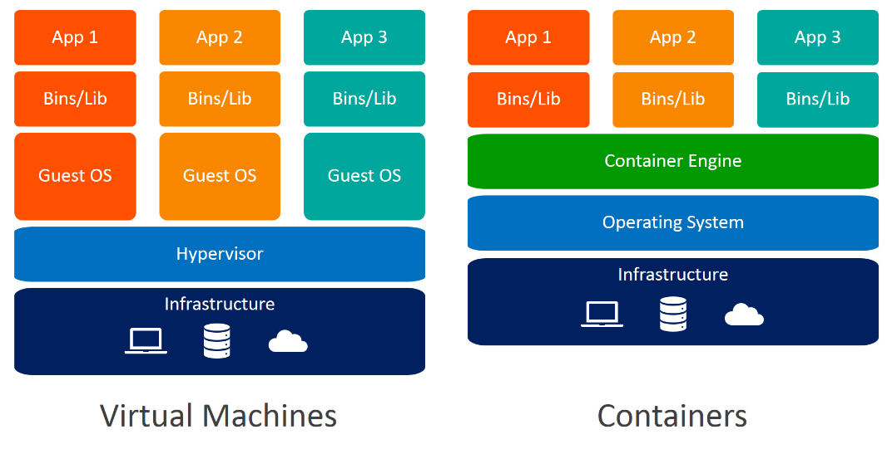

# Containers Intro

## Why Use Containers

### The Traditional Setup

- Host machine resources divided up into multiple virtual machines.
- Each virtual machine running an application.
- This has no ability to scale resources on the virtual machines:
  - At times of heavy load the machine resources are limited.
  - At times of low load the resources are under-utilised.



### The New Way

- Containers remove the need for virtual machines, by providing the
  isolation required between applications while retaining access to the
  essential low level operating system components on the main machine.
  - Instead of multiple separate operating systems running, a single
    operating system is required. Much more efficient.

## Cool. What can I use them for?

- Managing dependencies: isolating your code and dependencies from the
  host operating system allows you to have different versions of
  software installed in different containers.
- Running software without an install: for example the utility `rclone`
  can be used from it's container image (a pre-packaged environment,
  with all required dependencies: docker.io/rclone/rclone), instead of
  installing directly on your machine. Clean.
- Packaging your code for distribution or deployment: written a
  backend in Django? It can be packaged up into an image and deployed
  anywhere that has a container engine. Your laptop, local server,
  AWS, Azure… you name it.

**Containers are now the de-facto way to distribute software.
Software developers are required to know the basics of what they are,
how to build an image, and how to use a container.**

## Definitions

> Note: 'Docker' is often used in place of the word 'Container',
> as this was the main project to popularise containers.

- **Container (Docker Image)**: essentially a frozen state of an
  operating system, including filesystem, built-in command line tools,
  and your application code. This is built from a series of build
  instructions, almost exactly how you would have deployed your
  application onto a virtual machine.
- **Container**: a container image is used to create a running container.
  When you run a container, you may wish to specify a network to attach
  to, files to mount into the container, and other things.
- **Volume**: when a container is shut down, the filesystem is normally
  lost - it is ephemeral. A volume allows you to keep data after
  the containers lifecycle.

## Docker vs Kubernetes vs Other

- In the graphic above, Docker would be the **Container Engine**. It is
  what actually executes the commands to run the container and keep it running.
- Docker runs on your local machine with single containers.
  Docker Inc made a product called Docker Swarm, to allow for the
  management of containers across a fleet of servers.
  It essentially lost the battle to a Google-backed tool called Kubernetes.
- Kubernetes is a container orchestration tool and now the standard for
  how businesses deploy their software, in a way that is resilient to
  server crashes, code logic errors, etc.
  - If a process fails on one server, e.g. a Django API server, it
    will automatically be replaced by an equivalent container on another server.

## Show Me the Code

### Running containers

[https://docs.docker.com/engine/reference/commandline/run/](https://docs.docker.com/engine/reference/commandline/run/)

- Run a simple Ubuntu container, based off the Ubuntu Focal image:

```bash
docker run -it docker.io/ubuntu:focal bash
```

- The -it flag is to tell docker to open an interactive ('i') terminal
  ('t') for you to type commands into the container.
- The command after the image name is simply `bash`, which runs a bash
  terminal (as opposed to a basic shell terminal: `sh`).
- The other mode to run containers is detached (-d), but for this you
  need a process to run, for example python /app/code/main.py

### Building Images

Two components are required here:

- A Dockerfile (Containerfile). This contains the commands, in order,
  that install the dependencies from base image (e.g. Ubuntu), then add
  your application code into the image.
- A build instruction. The command line instruction to build an image,
  giving it a name etc:
  [https://docs.docker.com/engine/reference/commandline/build/](https://docs.docker.com/engine/reference/commandline/build/)

Example build:
[https://docs.docker.com/get\-started/02_our_app/](https://docs.docker.com/get-started/02_our_app/)

Lots of good tutorials can be found online, search for:
Dockerfile build example / tutorial.
