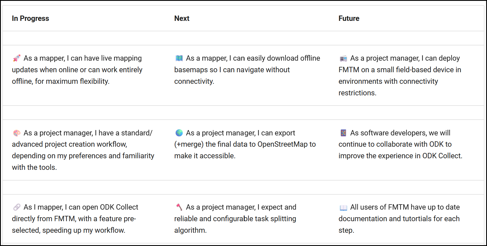
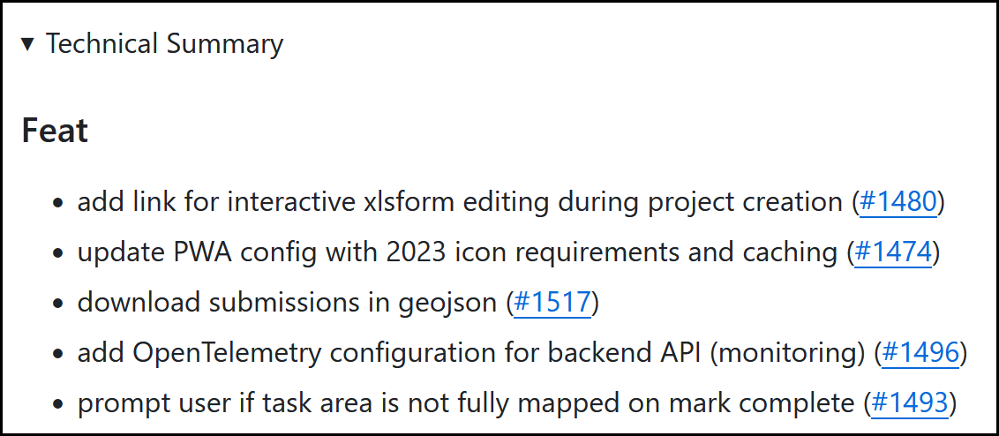

# HOT's Development Practices

This was last updated on 08/07/2024 and details our idealised
software development practices.

## Open-Source Model

- All code developed at HOT is open-source.
  - We rely heavily on community feedback to steer our development.
  - Contribution from **anyone** is welcome.
- We follow a git-flow, or fork-and-pr model:
  - Developers should create a fork of the repo they wish to modify.
  - Code is added to a branch inside _the fork_.
  - A pull request (merge request or PR) is made against the development
    branch of the original repository.
- Our code is generally licensed
  [AGPLv3](https://www.gnu.org/licenses/agpl-3.0.en.html)
  unless otherwise specified.

> Note: some tools still use BSD-2-Clause:
>
> - Tasking Manager
> - Export Tool
> - Open Aerial Map
>   [More details here](./dev-guide/repo-management/licensing.md)

## Defining **What** We Build

### Gathering Requirements

- When a project is first conceived, we have an idea of requirements / direction.
- Over time the requirements are dynamic and interative. We have two approaches.

#### Translating User Requirements Into Actions

- Our main feedback mechanism is through user testing. This should be done in
  collaboration with our hubs and partners to determine: what works well, and what
  doesn't. The general public will also use our tools and provide feedback.
- For field-based tools (FMTM, DroneTM), this would involve running mapping campaigns
  and gathering feedback from the teams involved.
- For desk-based tools (everything else), we mostly gather feedback through informal
  channels such as Slack.
- All tools have a public channel on Slack for discussion, providing feedback, and
  gathering requirements.
- Once we have gathered feedback, this should be divided up into actionable Git
  issues by the PO / Tech Lead and grouped into milestones or releases.

  > See the [milestones](#milestones) and [releases](#releases) sections
  > for details about grouping tasks into themes.

#### Gathering Direct Technical Feedback

- Users that are more tech-focused can create issues directly on our Git project.
- Discussions can also be used on our Git tracker for more general user input or
  feedback.
- Most often this will be bug reports, which should generally be high priority for
  the next release (or a hotfix to production if `critical` priority).
- The PO / Tech Lead should triage tasks, assign priorities, and group into milestones
  or releases.

  > See the [issue labels section](#issue-tags) for details about priority assignment.

### Setting Priorities

- Generally bugs will take priority over new features, particularly those blocking
  the users workflow.
- Milestones for a tool will be assessed based on internal team discussion, in
  addition to public Slack and Git-based discussion.
- The determined priorities and milestones will be a tradeoff between:
  - Original vision and goals of the tool.
  - Most prominent user requests.
  - Global events and crisis response (activations).
  - Requirements from actively engaged stakeholders / organization.

> In future, we would like to better involve the public via a technical steering
> commitee or similar.

### Keeping Track Of Tasks

Users can keep informed about ongoing tasks in various ways:

- Public announcements on Slack / blog posts.
- Releases on Github and included release notes.
- The overarching [roadmap](#roadmaps), showing progress for milestones and releases.
- Progress towards specific [milestones](#milestones), for new features.
- The [task tracker](#task-board) for individual issue progress (particularly
  for bugs).
- Any [discussions](#discussions) around particular features that have not been agreed
  upon and translated into an issue / milestone.

### Questions / Clarification

- HOT works fully in the open and is accountable for being clear about changes
  made to our tools.
- If clarity is poor about what the vision of our tools are, features we are planning,
  how we work, when requirements will be met, or anything else, then we have open
  channels of communication:
  - Via our public [Slack](https://slack.hotosm.org), either in channels related
    to a tool, or as a private message to a member of the tech team.
  - Via Github [issues](#issues--features) or [discussions](#discussions).
  - Direct message or email to the Product Owner or Tech Lead of the tool in question.
  - In the monthly 'Open Tech and Innovation Space' calls advertised on Slack.
  - In future, we also hope to have something akin to a 'Technical Steering Commitee',
    in which any tech-facing member of the public is welcome to provide input.

## Defining **How** We Build

### Git Repo Management

Management of tasks and code via Github.

#### Branches

- Generally our repos will have three key branches:
  - **dev**: the ongoing development to which PRs are made.
  - **stage**: optional branch where new features pass quality control
    stages prior to deployment to the main website.
  - **main**: the code that is currently deployed to the main website.

#### Issues / Features

##### Issue Tags

- Label / tag issues where appropriate, for example as backend or frontend.

- Priorities can be assigned:.

  - `priority:critical`: blocking current tasks or user workflow.
  - `priority:high`: should be addressed as a priority.
  - `priority:low`: backlog of tasks that will be addressed in time.

- Difficulty can be **estimated** (and may not be accurate):

  - `effort:low`: small task, likely a few hours.
  - `effort:medium`: larger task, may take a day or two.
  - `effort:high`: a broader scope task with unclear timeline.
    > Ideally there should not be many tasks with `effort:high`.
    > If there are, consider breaking them down to smaller tasks.

- The quality control status can be tracked:

  - `qa:ready`: the issue has been fixed and is ready to test.
  - `qa:fail`: the issue was not fixed as intended and requires additional
    work from the developer.
  - The `qa:xx` label can be removed when an issue is closed.

- Issues marked `good first issue` are approachable to newcomers in the repo.
  - Ideally the repo should always have a few low priority `good first issue`
    tags to help foster open source contribution / onboarding.

##### Issue Assignment

- Assign issues to the dev who will work on it.
- Issues can be assigned in advance if the devs is known.
- Devs can self-assign tasks.

#### Writing & Merging Code

PR = pull request, merge request, or similar terminology simply meaning to merge
code!

##### PR Drafts

- Create a draft PR for works in progress.
- Push as early as possible to draft, especially if there is a chance you
  may get sidetracked on other work (so another dev could feasibly pick
  up where you left off).

##### PR Assignment

- Assign yourself if you are working on the issue.
- Assign another dev if you need to pass off the development to them.
- The re-assigned dev can then assign the task back to the original dev for
  validation.

##### PR Review

- Any developer can review a PR, **as long as one dev reviews** prior to
  merge.
- Assign devs for review - frontend can review backend and vice versa.
- Once review is complete and the PR is out of draft state, then any dev can
  merge.

### Project Management

Still related to Github, but describing higher level project management
and project direction.

#### Milestones

- Encapsulates a set of issues into a logical bigger task, with or without
  an assigned deadline.
- Discussed in team meetings and decided on via priorities.
- Project Owner (PO) decides on priorities, tech lead decides on which tasks
  are required to achieve that goal.
- Milestones are grouped into a release, which has a set deadline.

#### Releases

- A release encompasses multiple milestones, plus additional bugfixes
  and minor improvements.
- Releases are tracked on the roadmap and have an _approximate_ deadline.
- Ideally releases should be around once a month at minimum, to regularly
  deliver incremental updates to the user (~agile project management).

#### Roadmaps

##### Technical Roadmap

- Higher level roadmap based on releases and milestones.
- Managed on Github, linked in the README.
- The roadmap should include:
  - Milestones (with optional dates) and issues linked to releases.
  - Releases labelled over the top, showing the anticipated next release date.

Example (from FMTM):


##### User Roadmap

- Most users do not want to delve into Github roadmaps and issues.
- A simpler user-centric roadmap can be written in simple Markdown
  table syntax.
- The key columns / categories in order:
  - In Progress: what is being worked on right now.
  - Next: what will be worked on in upcoming releases.
  - Future: a concept envisioned, but not fully planned out.
- The content should be worded as user stories:
  For example: `As a user I should be able to push the button, to allow me to
track my mapping progress more effectively`.

Example user roadmap (from FMTM):



#### Task Board

- An optional stage to easier visualise developer time.
- Should be as automated as possible:
  - Issues added to a project are added to the backlog.
  - Issues assigned to a dev are moved to 'In Progress'.
  - Issues labelled with `QA Ready` are moved to 'Review'.
  - Issues completed should be moved to 'Complete'.
- Ideally we can keep track of which developer is working on
  what task.
- This becomes especially important when we also have outside collaborators.

Example:


#### Discussions

- To discuss more general topics in the public, so that anyone can contribute.
- Partly used to document the design decisions we have taken.
- Tag people specially for input, as it makes them more likely to add ideas.
- We can also use these for the staging server tests on each release cycle,
  e.g. <https://github.com/hotosm/fmtm/discussions/1335>

#### Release Notes

- No technical details, move those to a dropdown in markdown:

Example:

```md
<details>
  <summary>Technical Summary</summary>
    * Add healthcare form category & minor fixes by @spwoodcock in https://github.com/hotosm/fmtm/pull/1555
    * Fix/requested page redirection by @NSUWAL123 in https://github.com/hotosm/fmtm/pull/1559
    * Test coverage for update project route by @azharcodeit in https://github.com/hotosm/fmtm/pull/1557
</details>
```



- Higher level info on bugs fixed, new features added, things improved.
- Add screenshots throughout.
