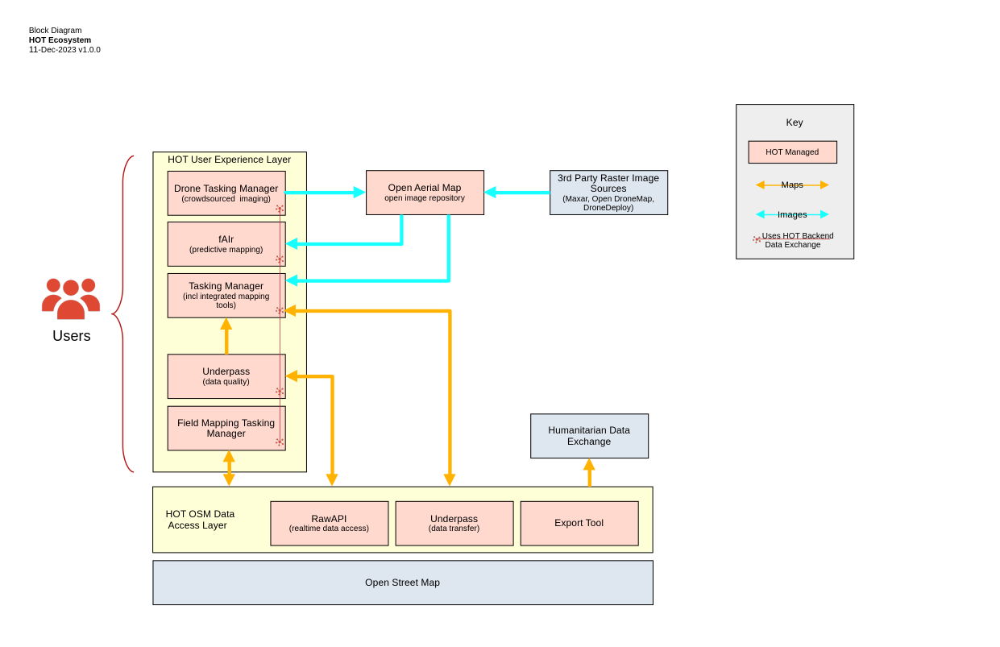
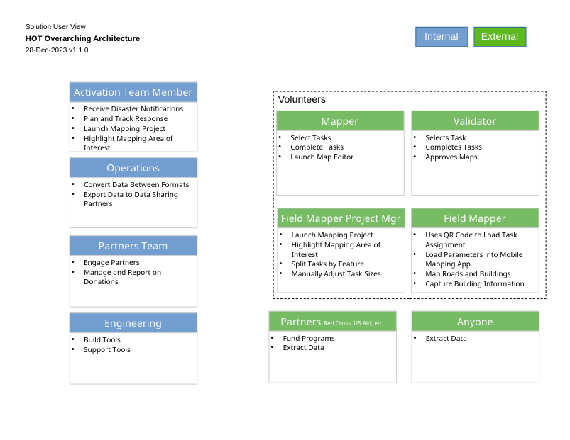
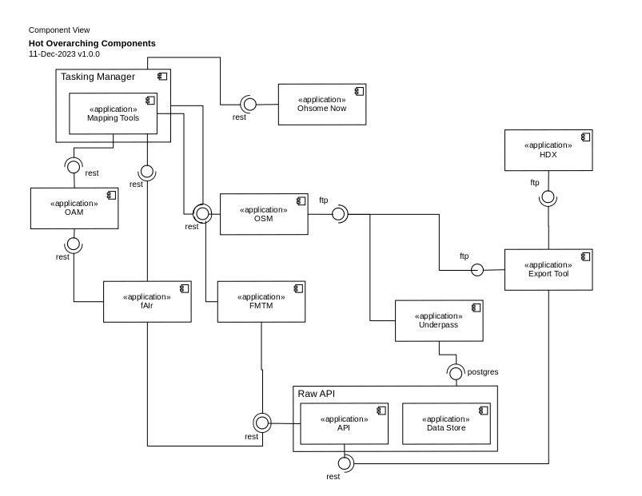
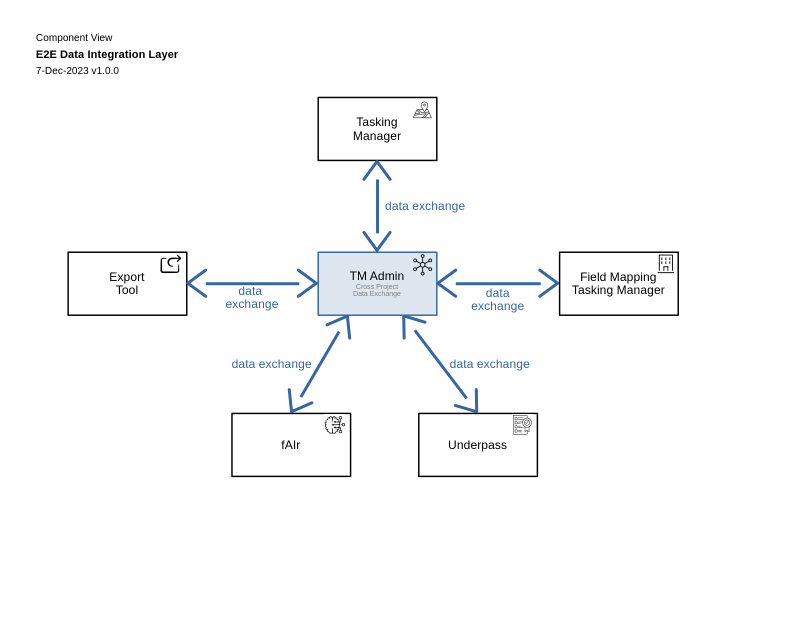
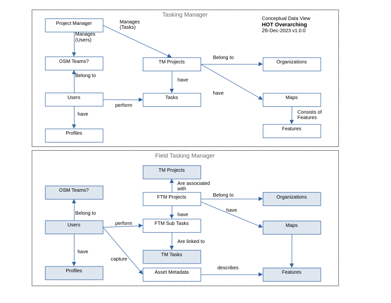

# Overarching Architecture Folder

While today HOT architecture consists of a wide range of applications
and modules, the vision for the future is a more unified ecosystem.

The key features of this architecture are:

- An integrated set of back-end modules
- A common data model based on standards and only extending as required
- Fit for purpose front-ends, built on REACT

## HOT Overview

This is an overarching view of the HOT ecosystem of solutions. It
includes some key non-HOT components for context and because they
serve an important role in the ecosystem.

## Solution User View

This solution user view provides a user-centric view of the HOT
architecture showing the key user roles and what activities they will
perform using the solution. You can learn more about the diagram and
notation
[here](HOTSolutionUser.png).

## Information Flow

This information flow is a dynamic view that shows the flow of
information (in high level business terms) between the HOT ecosystem
components. You can learn more about the diagram and notation
[here](https://github.com/hotosm/techdoc/wiki/Architecture-Documents-Walkthrough#information-flow).

## Component Model

This component model is a static view that shows how the HOT ecosystem
components connect to one another. You can learn more about the
diagram and notation
[here](https://github.com/hotosm/techdoc/wiki/Architecture-Documents-Walkthrough).

## E2E Data Integration Diagrams

This is the high level concept for the E2E data integration
approach. The TD Admin components in the center are not actually a hub
instance, but a set of shared modules used for connectivity.

 

## E2E Integration Sequence Diagrams

These show the interactions between multiple components at a more detailed level.

|  |  |
|  | . |

## E2E Conceptual Data Model

This is a conceptual data model, illustrating the key entities and
relationship in the data model.

